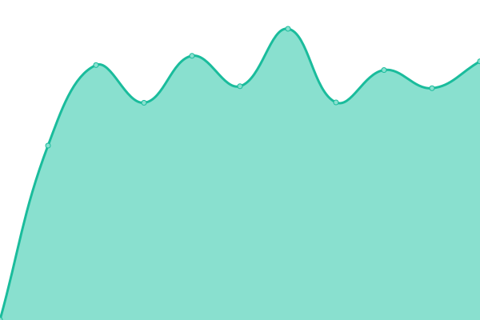

# [📈 Live Status](https://ntgussoni.github.io/mn-test): <!--live status--> **🟩 All systems operational**

This repository contains the open-source uptime monitor and status page for [Nicolas Torres](https://ntgussoni.github.io/mn-test), powered by [Upptime](https://github.com/upptime/upptime).

With [Upptime](https://upptime.js.org), you can get your own unlimited and free uptime monitor and status page, powered entirely by a GitHub repository. We use [Issues](https://github.com/ntgussoni/mn-test/issues) as incident reports, [Actions](https://github.com/ntgussoni/mn-test/actions) as uptime monitors, and [Pages](https://ntgussoni.github.io/mn-test) for the status page.

<!--start: status pages-->
<!-- This summary is generated by Upptime (https://github.com/upptime/upptime) -->
<!-- Do not edit this manually, your changes will be overwritten -->
<!-- prettier-ignore -->
| URL | Status | History | Response Time | Uptime |
| --- | ------ | ------- | ------------- | ------ |
|  [ntorres.dev](https://ntorres.dev) | 🟩 Up | [ntorres-dev.yml](https://github.com/ntgussoni/mn-test/commits/HEAD/history/ntorres-dev.yml) | 

 556ms
     
 | 

<a href="https://ntgussoni.github.io/mn-test/history/ntorres-dev">100.00%</a>
    

|  [bedtimefable.com](https://bedtimefable.com) | 🟩 Up | [bedtimefable-com.yml](https://github.com/ntgussoni/mn-test/commits/HEAD/history/bedtimefable-com.yml) | 

 242ms
     
 | 

<a href="https://ntgussoni.github.io/mn-test/history/bedtimefable-com">100.00%</a>
    

|  [bedtimefable](https://bedtimefable.ai) | 🟩 Up | [bedtimefable.yml](https://github.com/ntgussoni/mn-test/commits/HEAD/history/bedtimefable.yml) | 

 1444ms
     
 | 

<a href="https://ntgussoni.github.io/mn-test/history/bedtimefable">100.00%</a>
    

|  [mh](https://www.maidofhonorspeech.net) | 🟩 Up | [mh.yml](https://github.com/ntgussoni/mn-test/commits/HEAD/history/mh.yml) | 

 756ms
     
 | 

<a href="https://ntgussoni.github.io/mn-test/history/mh">100.00%</a>
    

|  [htbbm](https://www.howtobebestman.com) | 🟩 Up | [htbbm.yml](https://github.com/ntgussoni/mn-test/commits/HEAD/history/htbbm.yml) | 

 716ms
     
 | 

<a href="https://ntgussoni.github.io/mn-test/history/htbbm">100.00%</a>
    

<!--end: status pages-->

[**Visit our status website →**](https://ntgussoni.github.io/mn-test)

## 📄 License

- Powered by: [Upptime](https://github.com/upptime/upptime)
- Code: [MIT](./LICENSE) © [Anand Chowdhary](https://anandchowdhary.com), supported by [Pabio](https://pabio.com)
- Data in the `./history` directory: [Open Database License](https://opendatacommons.org/licenses/odbl/1-0/)
